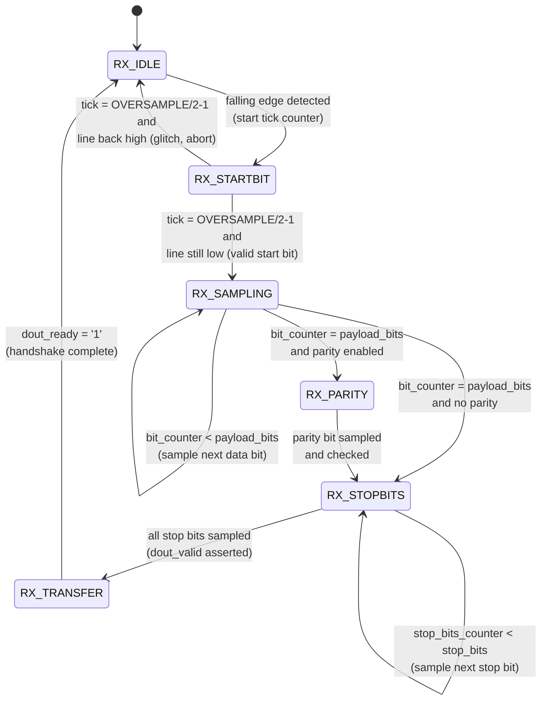
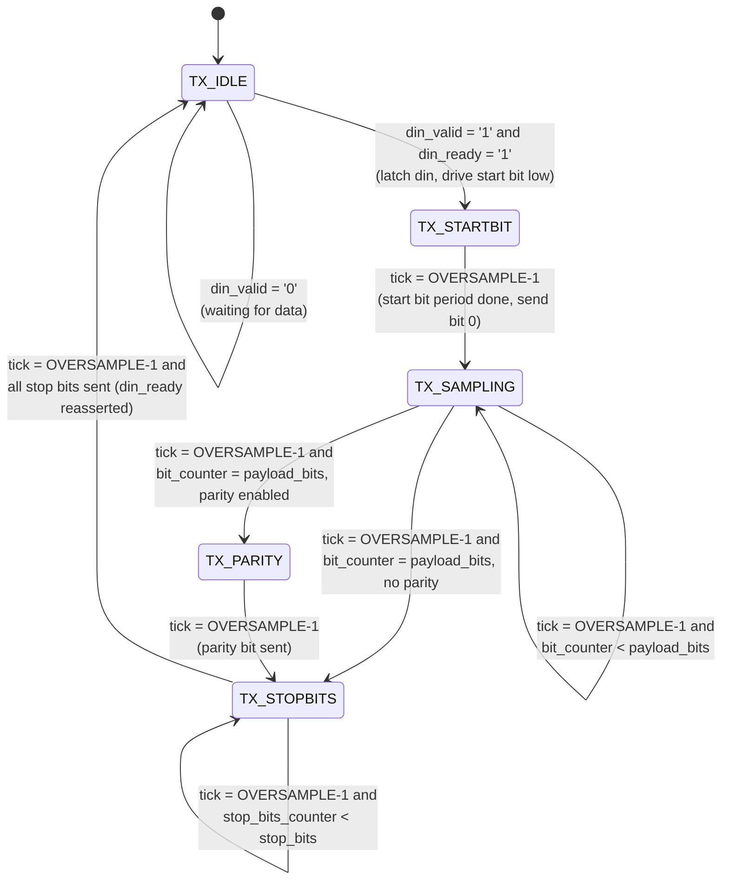

# axistream_uart — Product Guide

**Configurable AXI-Stream UART Core**
Target device: Xilinx Basys 3 | VHDL-2008 | Vivado 2026.1  
Author: Abdelrahman Hewala (Shiro)

---

## 1. Overview

`axistream_uart` is a fully parameterizable UART transceiver with AXI-Stream compatible
handshaking on both the receive and transmit data paths. Frame geometry (parity mode,
data width, stop bit count) and baud rate are all set through generics, so a single RTL
source produces optimized hardware for whichever configuration is instantiated —
unused parity/stop-bit logic is eliminated by the synthesis tool rather than carried as
dead logic.

Both directions use independent state machines and independent bit-tick counters,
driven from a shared fractional NCO baud-rate generator.

---

## 2. Interface

### 2.1 Generics

| Generic         | Type      | Default     | Description |
|------------------|-----------|-------------|-------------|
| `BAUDRATE`       | natural   | 115200      | Target baud rate. Minimum supported: 110. |
| `PARITY_MODE`    | natural   | 0           | `0` none, `1` even, `2` odd. |
| `EIGHT_BIT`      | boolean   | true        | `true` = 8 data bits, `false` = 7 data bits. |
| `TWO_STOP_BITS`  | boolean   | false       | `false` = 1 stop bit, `true` = 2 stop bits. |
| `OVERSAMPLE`     | natural   | 16          | RX oversampling factor (ticks per bit period). |
| `CLK_FREQ_HZ`    | natural   | 100,000,000 | System clock frequency in Hz. |

### 2.2 Ports

| Port          | Dir | Width | Description |
|---------------|-----|-------|-------------|
| `clk`         | in  | 1     | System clock. |
| `rst_n`       | in  | 1     | Active-low synchronous reset. |
| `uart_txd`    | out | 1     | UART transmit line. |
| `uart_rxd`    | in  | 1     | UART receive line. |
| `din`         | in  | 8     | Data to transmit (AXI-Stream `tdata`). |
| `din_valid`   | in  | 1     | Upstream has data (AXI-Stream `tvalid`). |
| `din_ready`   | out | 1     | Core can accept a new byte (AXI-Stream `tready`). |
| `dout`        | out | 8     | Received byte (AXI-Stream `tdata`). Valid only while `dout_valid = '1'`. |
| `dout_valid`  | out | 1     | Received byte ready (AXI-Stream `tvalid`). |
| `dout_ready`  | in  | 1     | Downstream can accept the byte (AXI-Stream `tready`). |
| `frame_error` | out | 1     | Stop bit sampled low — framing error. Valid alongside `dout_valid`. |
| `parity_error`| out | 1     | Parity mismatch. Valid alongside `dout_valid`. |

**Note on 7-bit mode:** `din` and `dout` are always 8 bits wide regardless of
`EIGHT_BIT`. In 7-bit mode, bit 7 of `dout` is not part of the received frame and must
be disregarded by the consuming logic. Bit 7 of `din` is likewise not transmitted.

---

## 3. Baud Rate Generation — Fractional NCO

A fixed integer clock divider bakes in one rounding error every tick, which
accumulates into baud-rate drift over a long frame. Instead, this core uses a
numerically controlled oscillator (NCO): a phase accumulator that adds a fixed
fractional step every clock cycle and emits a tick pulse on overflow. The **average**
tick rate converges exactly to the target rate, with error bounded by
`1 / 2^ACC_WIDTH` rather than accumulating without bound.

### 3.1 Derivation

The desired tick period, expressed as a fraction of the accumulator's full-scale
range, must equal the ratio of one tick period to one system clock period:

```
NCO_STEP / 2^ACC_WIDTH  =  (BAUDRATE * OVERSAMPLE) / CLK_FREQ_HZ
```

Solving for the step size:

```
NCO_STEP = round( (BAUDRATE * OVERSAMPLE / CLK_FREQ_HZ) * 2^ACC_WIDTH )
```

This is a compile-time constant — no real-valued arithmetic is synthesized into
hardware; only the resulting integer `NCO_STEP` is.

### 3.2 Implementation

```vhdl
constant NCO_ACC_WIDTH : natural := 24;
constant NCO_STEP : natural := natural(round(
    (real(BAUDRATE) * real(OVERSAMPLE) / real(CLK_FREQ_HZ)) * (2.0 ** NCO_ACC_WIDTH)
));
```

Each clock cycle:

```vhdl
sum     := ('0' & nco_acc) + to_unsigned(NCO_STEP, NCO_ACC_WIDTH + 1);
nco_acc <= sum(NCO_ACC_WIDTH - 1 downto 0);   -- retained fractional remainder
baud_tick <= sum(NCO_ACC_WIDTH);              -- carry-out = tick pulse
```

`baud_tick` pulses once every `OVERSAMPLE`-th bit-tick period, i.e. at a rate of
`BAUDRATE * OVERSAMPLE`. Each engine's own tick counter divides this down further to
produce one tick per `OVERSAMPLE` pulses, which is the actual bit period.

### 3.3 Worked example

With `CLK_FREQ_HZ = 100_000_000`, `BAUDRATE = 115200`, `OVERSAMPLE = 16`:

```
NCO_STEP = round( (115200 * 16 / 100_000_000) * 2^24 )
         = round( 0.018432 * 16,777,216 )
         = round( 309,237.6461 )
         = 309,238
```

The rounding error of 0.3539 (versus the ideal 309,237.6461) is distributed across
the *entire run time* of the accumulator rather than applied once per bit — this is
what keeps long-run average baud rate accuracy far tighter than a plain integer
divider would achieve at the same accumulator width.

---

## 4. RX Engine

### 4.1 State Machine



- **RX_IDLE** — Watches for a falling edge (idle-high → low) on the synchronized RX
  line, which starts the tick counter and moves to `RX_STARTBIT`.
- **RX_STARTBIT** — At the bit-center tick (`OVERSAMPLE/2-1`), the line is re-sampled:
  if it has returned high, this was a noise glitch and the state machine aborts back
  to idle without committing to a frame. If it is still low, this is confirmed as a
  genuine start bit and the machine proceeds to sampling. The tick counter is not
  reset on this transition, so the first data bit's own bit-center lands exactly one
  full bit period later.
- **RX_SAMPLING** — Samples each payload bit at its bit-center tick, shifting it
  LSB-first into an 8-bit shift register. Runs `payload_bits` times (7 or 8).
- **RX_PARITY** — Present only when a parity bit is configured. Samples the parity bit
  at bit-center and compares it against the XOR-reduction of the received payload,
  according to the configured even/odd convention.
- **RX_STOPBITS** — Samples each stop bit at bit-center. Any stop bit sampled low sets
  `frame_error`.
- **RX_TRANSFER** — Asserts `dout_valid` and holds the received byte stable until the
  downstream consumer asserts `dout_ready`, per AXI-Stream handshake semantics.

### 4.2 RX cross-domain synchronization

`uart_rxd` is asynchronous to `clk` and is passed through a 3-stage synchronizer
(`uart_rx_sync_ff1` / `uart_rx_sync_ff2` / `uart_rx_sync_ff2_dly`) before any use in
the RX engine — two stages for metastability protection, the third purely to support
clean falling-edge detection in `RX_IDLE`.

---

## 5. TX Engine

### 5.1 State Machine



- **TX_IDLE** — Asserts `din_ready` while free. On a valid handshake
  (`din_valid = '1'` and `din_ready = '1'`), latches `din` into the shift register,
  computes the parity bit (if configured) over only the active payload width
  (`din(payload_bits-1 downto 0)`), drives the line low for the start bit, and starts
  the tick counter.
- **TX_STARTBIT** — Holds the start bit low for one full bit period, then sends the
  first data bit (LSB) at the same instant the period completes.
- **TX_SAMPLING** — Holds each subsequent payload bit on `uart_txd` for a full bit
  period (`OVERSAMPLE` ticks), shifting the register right (LSB-first transmission)
  after each bit period completes.
- **TX_PARITY** — Present only when a parity bit is configured. Drives the latched
  parity bit for one full bit period.
- **TX_STOPBITS** — Drives the line high for `stop_bits` full bit periods, then
  reasserts `din_ready` for the next transfer.

### 5.2 Tick counter continuity

Both the RX and TX tick counters run continuously across state transitions within a
single frame — they are only reset to 0 when the corresponding `start_*_tick_counter`
signal drops, which happens once per completed (or aborted) frame, not once per state.
This keeps every bit period, including the start bit and the transition between
states, at a consistent `OVERSAMPLE`-tick duration. Verified by hand-tracing total
frame length for both 1-stop-bit and 2-stop-bit configurations against the expected
`1 + payload_bits + parity_bits + stop_bits` period count — both match exactly.

---

## 6. Known Limitations

- **7-bit mode data width**: `din`/`dout` remain 8 bits wide in all modes. In 7-bit
  mode, bit 7 is not part of the frame and must be disregarded by the integrating
  design.
- **No resynchronization scheme**: the core does not implement frame markers,
  checksums, or idle-gap resync. If byte loss due to downstream backpressure is a
  concern, ensure `dout_ready` is serviced promptly, or add buffering/framing at the
  system level.
- **VHDL-2008 required**: the core uses reduction operators (`xor vector`) and a
  generic-bounded slice, both of which require the VHDL-2008 language standard to be
  selected in the simulator/synthesis project settings.

---

## 7. Verification

- **Hardware timing (ILA)**: with `axistream_uart` driven by the BrassSense
  acquisition pipeline (48.007 kHz sample rate), an ILA probe on `uart_txd` measured
  exactly 2083 clock cycles between successive frame starts — matching the pipeline's
  theoretical sample period to the cycle, with no drift or jitter observed across
  multiple captures. This confirms the TX engine holds correct, stable bit timing
  under real operating conditions, not just in isolation.
- **End-to-end audio validation**: the core was exercised as the final stage of the
  full mic-acquisition pipeline (ADC → SPI → FIFO → serializer → UART). Recorded
  speech, streamed live over this core at 1,152,000 baud and reconstructed on a PC
  into a WAV file, played back correctly and was clearly recognizable — confirming
  correct framing, byte ordering, and timing under sustained, realistic data rates
  rather than a single isolated test transfer.
- **Simulation**: a self-checking loopback testbench (`uart_txd` tied directly to
  `uart_rxd`, mirroring the physical link) sends a set of test bytes through `din` and
  checks each is received correctly on `dout` with no `frame_error`/`parity_error`,
  using the same generics as the real hardware configuration.

---

## 8. Revision

| Rev  | Date       | Notes |
|------|------------|-------|
| 0.01 | 2026-07-26 | Initial RX/TX implementation. |
| 0.02 | 2026-08-08 | Split `RX_IDLE`/`TX_IDLE` start-bit handling into dedicated `RX_STARTBIT`/`TX_STARTBIT` states. Fixed a timing bug where tick-count comparisons fired on every clock cycle the counter held its target value (~`OVERSAMPLE` cycles) instead of once per `baud_tick` pulse, corrupting bit sampling; every comparison is now correctly gated on `baud_tick = '1'`. Fixed RX shift register direction, which was reconstructing received bytes bit-reversed. Migrated `PARITY_BIT` (character) to `PARITY_MODE` (natural), see Section 2.1. Added hardware verification results (Section 7). |
