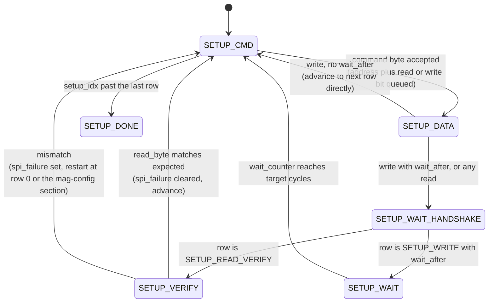
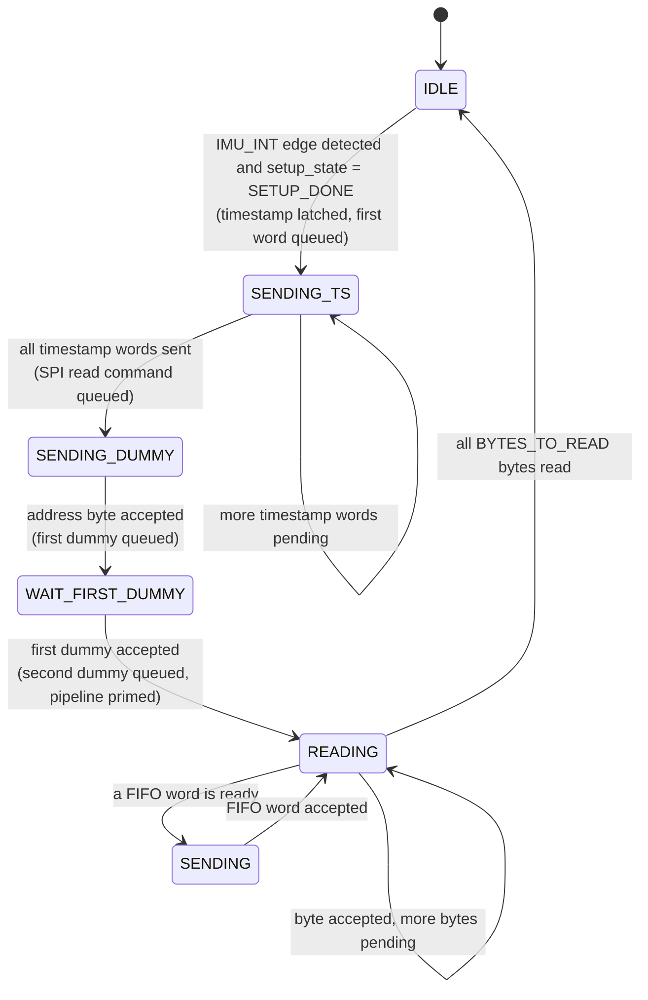

# spi_controller — Product Guide

**ICM-20948 SPI Acquisition Controller**
Target device: Xilinx Basys 3 | VHDL-2008 | Vivado 2026.1
Author: Abdelrahman Hewala (Shiro)

---

## 1. Overview

`spi_controller` drives an ICM-20948 (6-axis IMU plus AK09916 magnetometer)
over SPI via a downstream `spi_master` IP, and streams timestamped sensor
samples out over an AXI4-Stream interface to a FIFO. Two internally
multiplexed FSMs share the single AXI-Stream SPI port:

- **Setup FSM** (`setup_state`) runs once after reset. It walks a
  table-driven register-init sequence that resets and configures the
  ICM-20948's accelerometer and gyroscope, brings up the ICM's internal
  I2C master, resets and configures the AK09916 magnetometer via SLV4
  one-shot transactions, and arms SLV0 for continuous background
  magnetometer reads. Any write step can optionally be read back and
  verified; a mismatch sets a sticky `spi_failure` flag, restarts the
  affected section of the sequence, and clears the flag again once a
  retry passes.
- **Running FSM** (`running_state`) takes over once setup completes and
  `IMU_INT` is asserted. On each trigger it latches the current
  timestamp, pushes it out as `TIMESTAMP_WORDS` 16-bit AXI-Stream words,
  then issues a single burst SPI read starting at `ACCEL_XOUT_H`,
  streaming `BYTES_TO_READ` bytes back from the ICM and packing them
  into the FIFO burst.

**Currently, the ICM-20948's real `IMU_INT` pin is not connected at the
system level.** For bring-up, sampling is triggered by `ce_pulse_gen`
instead. See `FPGA/README.md` for how this is wired at the block-design
level; this document only covers `spi_controller` itself.

---

## 2. Interface

### 2.1 Generics

| Generic | Type | Default | Description |
|---------|------|---------|--------------|
| `BYTES_TO_READ` | natural | 23 | Number of SPI bytes read per burst. |
| `TIMESTAMP_WORDS` | natural | 4 | Number of 16-bit words the timestamp is split into. |
| `RESET_WAIT_CYCLES` | natural | 10,000,000 | ~100ms @ 100MHz, wait duration for the reset row of the setup table. |
| `GENERAL_WAIT_CYCLES` | natural | 10,000,000 | ~100ms @ 100MHz, wait duration for every other `wait_after` row. |

### 2.2 Ports

| Port | Dir | Width | Description |
|------|-----|-------|--------------|
| `clk` | in | 1 | System clock. |
| `rst_n` | in | 1 | Active-low synchronous reset. |
| `IMU_INT` | in | 1 | Sample trigger, synchronized and edge-detected internally. |
| `timestamp` | in | `TIMESTAMP_WORDS * 16` | Free-running timestamp, latched on each trigger. |
| `m_axis_fifo_tdata` | out | 16 | Sample word to the downstream FIFO. |
| `m_axis_fifo_tvalid` | out | 1 | Sample word valid. |
| `m_axis_fifo_tready` | in | 1 | FIFO can accept the word. |
| `m_axis_fifo_tlast` | out | 1 | Marks the final word of a burst. |
| `m_axis_spi_tdata` | out | 8 | Byte to `spi_master`, muxed between setup and running FSMs. |
| `m_axis_spi_tvalid` | out | 1 | Byte valid. |
| `m_axis_spi_tready` | in | 1 | `spi_master` can accept the byte. |
| `m_axis_spi_tlast` | out | 1 | Ends the current SPI CS cycle. |
| `read_byte` | in | 8 | Byte received back from `spi_master` for the in-flight transfer. |
| `spi_failure` | out | 1 | Sticky flag, set on a setup-time verify mismatch, cleared once a retry passes. |
| `setup_idx_dbg` | out | 8 | Current row index into the setup sequence, for ILA use. |
| `setup_done_dbg` | out | 1 | High once the setup FSM has finished. |

---

## 3. IMU Register Layout

The running FSM's burst read starts at `ACCEL_XOUT_H` and reads
`BYTES_TO_READ` (23) consecutive bytes:

| Bytes | Register | Notes |
|-------|----------|--------|
| 0-5 | ACCEL_XOUT_H/L, ACCEL_YOUT_H/L, ACCEL_ZOUT_H/L | |
| 6-11 | GYRO_XOUT_H/L, GYRO_YOUT_H/L, GYRO_ZOUT_H/L | |
| 12-13 | TEMP_OUT_H/L | |
| 14 | EXT_SLV_SENS_DATA_00 | AK09916 ST1, bit0 DRDY, bit1 DOR |
| 15-20 | EXT_SLV_SENS_DATA_01 to 06 | AK09916 HXL/HXH, HYL/HYH, HZL/HZH |
| 21 | EXT_SLV_SENS_DATA_07 | reserved/TMPS, unused |
| 22 | EXT_SLV_SENS_DATA_08 | AK09916 ST2, bit3 HOFL overflow |

### FIFO burst layout

One burst per trigger, 15 words, `tlast` on the final word:

| Word | Content |
|------|---------|
| 0-3 | timestamp, MSB word first |
| 4-9 | accel X/Y/Z, gyro X/Y/Z, each `{H, L}` |
| 10 | temp `{H, L}` |
| 11-13 | mag X/Y/Z, normalized to `{H, L}` (wire order is little-endian on the AK09916) |
| 14 | `{ST2, ST1}` |

---

## 4. Setup FSM

- **SETUP_CMD** queues the next row's address byte (read or write bit set
  per the row's `op`), or moves to `SETUP_DONE` once every row has been
  processed.
- **SETUP_DATA** queues the row's write value, or a dummy byte for a read,
  then routes to `SETUP_CMD` directly (writes with no wait), or to
  `SETUP_WAIT_HANDSHAKE` (writes with a wait, and all reads).
- **SETUP_WAIT_HANDSHAKE** waits for that second byte's transfer to
  complete, then splits to `SETUP_VERIFY` for a read, or `SETUP_WAIT` for
  a write that needs a delay.
- **SETUP_VERIFY** compares `read_byte` against the row's expected value.
  On a mismatch, `spi_failure` is set and the sequence restarts, either
  from row 0 or from `MAF_CONFIG_ROW_IDX` (the start of the magnetometer
  configuration section) depending on how far setup had progressed. A
  passing verify clears `spi_failure` again.
- **SETUP_WAIT** holds for `RESET_WAIT_CYCLES` (row index equals
  `RESET_ROW_IDX`) or `GENERAL_WAIT_CYCLES` (every other `wait_after`
  row), then advances.

---

## 5. Running FSM

- **IDLE** watches for the synchronized `IMU_INT` edge while setup is
  done. On trigger it latches `timestamp`, queues the MSB timestamp word,
  and moves to `SENDING_TS`.
- **SENDING_TS** sends the remaining `TIMESTAMP_WORDS - 1` words, then
  queues the SPI read command (`ACCEL_XOUT_H` with the read bit set) and
  moves to `SENDING_DUMMY`.
- **SENDING_DUMMY** and **WAIT_FIRST_DUMMY** send two priming dummy bytes
  before entering `READING`, so that from `READING` onward each accepted
  byte's `read_byte` corresponds directly to the register at that byte
  index.
- **READING** accepts one byte per handshake and assembles FIFO words as
  pairs complete, with three special cases:
  - byte 14 (ST1) is latched into `status_reg` rather than paired.
  - byte 20 (mag Z high byte) completes the mag-Z word and queues the
    final dummy, which fetches ST2.
  - byte 21 (reserved, unused) stops further SPI sending once its
    response arrives, since the dummy fetching ST2 has already been
    queued.
  - byte 22 (ST2) completes on the final transfer's handshake, builds
    `{ST2, status_reg}`, and asserts the FIFO `tlast`.
- **SENDING** holds each FIFO word until the FIFO accepts it, then
  returns to `READING` for the next byte, or to `IDLE` once
  `read_bytes_counter` reaches `BYTES_TO_READ`.

---

## 6. Known Limitations

- **Backpressure assumption**: `m_axis_fifo_tready` is assumed to never
  stay low longer than one SPI byte period. If violated, SPI byte
  tracking desyncs.

- **`RESET_ROW_IDX` is currently dead**: reseting the chip leads to stalling so 
the reset command is commented out.

- **AK09916 WHO_AM_I verification is commented out**.

- **Real `IMU_INT` pin not connected**, as noted in the overview.

---

## 7. Verification

A self-checking testbench (`tb_spi_controller`) models `spi_master` as a
realistic SPI slave stub, taking a full byte period (160 cycles, matching
an assumed 5MHz SCLK at a 100MHz system clock) per transfer rather than
handshaking instantly. During setup, the stub echoes the golden expected
value for whichever row `setup_idx_dbg` reports, so every verify passes
and `setup_done_dbg` asserts without retries. During the running phase,
it returns each payload byte's own index, resetting on the address bytethat starts each burst.

---

## 8. Revision

| Rev | Date | Notes |
|-----|------|-------|
| 0.01 | - | Initial two-FSM implementation. |
| 0.02 | 2026-08-20 | Fixed `SETUP_VERIFY`'s failure branch not resetting `setup_state` back to `SETUP_CMD`, which had left the FSM stuck rather than retrying. Added clearing of `spi_failure_r` on a passing verify|