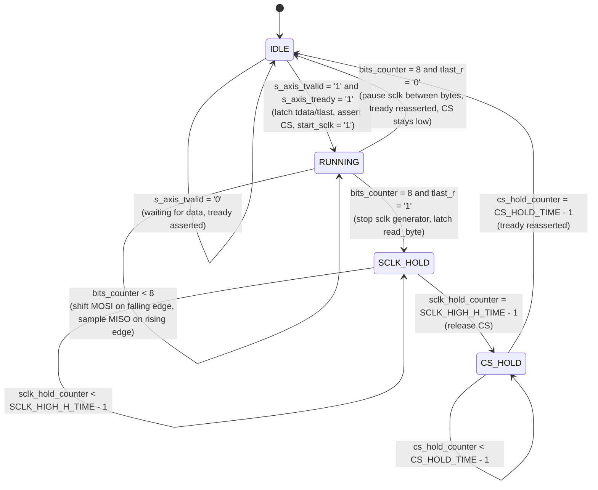

# spi_master — Product Guide

**AXI-Stream Compatible SPI Master (Mode 3)**
Target device: Xilinx Basys 3 | VHDL-2008 | Vivado 2026.1
Author: Abdelrahman Hewala (Shiro)

---

## 1. Overview

`spi_master` is a full-duplex SPI master core, hardwired to Mode 3
(`CPOL = 1`, `CPHA = 1`), built to provide the communication interface to an
ICM-series IMU. SCLK frequency and the two inter-transaction hold times are all set
through generics, so a single RTL source produces the correct timing for whichever
system clock / target SCLK combination is instantiated.

The core exposes a single AXI-Stream compatible slave port for the byte to transmit,
plus a plain result output for the byte simultaneously received — a deliberately
minimal interface, not a stripped-down one; see Section 5 for why a second,
independent AXI-Stream in the return direction is unnecessary here.

A single finite state machine drives both the SCLK generator and the CS/hold-time
sequencing, so the entire byte-level and transaction-level timing contract lives in
one place.

---

## 2. Interface

### 2.1 Generics

| Generic            | Type    | Default | Description |
|---------------------|---------|---------|-------------|
| `CLK_DIV_HALF`      | natural | 10      | Half of the target SCLK clock divider. For a 100 MHz system clock and a desired 5 MHz SCLK, this value is `10`. **Must be ≥ 2** — enforced by an elaboration-time assert (see Section 6). |
| `SCLK_HIGH_H_TIME`  | natural | 50      | Minimum hold time between the last SCLK rising edge and CS de-assertion, in system clock cycles (`10 ns` units at 100 MHz — default is 500 ns). **Must be ≥ 1.** |
| `CS_HOLD_TIME`      | natural | 5       | Minimum time CS is held high before the master will accept a new transaction, in system clock cycles (`10 ns` units — default is 50 ns). **Must be ≥ 1.** |

### 2.2 Ports

| Port            | Dir | Width | Description |
|------------------|-----|-------|-------------|
| `clk`            | in  | 1     | System clock. |
| `rst_n`          | in  | 1     | Active-low synchronous reset. |
| `s_axis_tready`  | out | 1     | Master can accept a new byte to transmit. |
| `s_axis_tvalid`  | in  | 1     | Controller has a byte ready to transmit. |
| `s_axis_tdata`   | in  | 8     | Byte to shift out on `spi_mosi`, MSB first. |
| `s_axis_tlast`   | in  | 1     | Marks this as the final byte of the transaction — CS is released once it completes. `'0'` continues the transaction (CS stays asserted, SCLK pauses between bytes). |
| `read_byte`      | out | 8     | Byte simultaneously shifted in from `spi_miso` during the just-completed transfer. Not an AXI-Stream port — see Section 5 for its validity contract. |
| `spi_sclk`       | out | 1     | SPI clock line. Idle-high (Mode 3 / CPOL = 1). |
| `spi_cs_n`       | out | 1     | Chip select, active low. |
| `spi_mosi`       | out | 1     | Master-out-slave-in line. |
| `spi_miso`       | in  | 1     | Master-in-slave-out line. |

---

## 3. Clock Generation — SCLK Divider

### 3.1 Derivation

SCLK toggles once every `CLK_DIV_HALF` system clock cycles, giving a full SCLK period
of `2 * CLK_DIV_HALF` system clock cycles:

```
SCLK_FREQ = CLK_FREQ_HZ / (2 * CLK_DIV_HALF)
```

Solving for the generic:

```
CLK_DIV_HALF = CLK_FREQ_HZ / (2 * SCLK_FREQ)
```

Unlike a fractional NCO, this is an exact integer relationship — no rounding error is
introduced provided `CLK_FREQ_HZ` is evenly divisible by `2 * SCLK_FREQ`. If it isn't,
`CLK_DIV_HALF` is rounded to the nearest integer and the resulting SCLK frequency will
be the nearest achievable rate, not the literal target.

### 3.2 Implementation

```vhdl
if start_sclk = '1' then
    if hold_sclk = '0' then
        if sclk_counter = CLK_DIV_HALF - 1 then
            spi_sclk_r  <= not spi_sclk_r;
            sclk_counter <= 0;
        else
            sclk_counter <= sclk_counter + 1;
        end if;
    end if;
else
    sclk_counter <= CLK_DIV_HALF - 1;   -- re-armed, ready to toggle on the very next cycle
    spi_sclk_r   <= '1';                -- forced idle-high
end if;
```

`start_sclk` gates whether the divider runs at all; `hold_sclk` freezes it mid-phase
without losing its place (used between bytes of a burst — see Section 4.1). When
`start_sclk = '0'`, the counter isn't just stopped, it's actively re-armed to
`CLK_DIV_HALF - 1` every cycle — this is what gives every transaction, not just the
first, an identical one-cycle CS-to-first-SCLK-edge delay (see Section 5.2 for why
this distinction matters and how it was verified).

### 3.3 Worked example

With `CLK_FREQ_HZ = 100_000_000` and a target `SCLK_FREQ = 5_000_000`:

```
CLK_DIV_HALF = 100_000_000 / (2 * 5_000_000) = 10
```

Matching the generic's default value.

---

## 4. Master FSM

### 4.1 State Machine



- **IDLE** — Asserts `s_axis_tready` while free. On a valid handshake
  (`s_axis_tvalid = '1'` and `s_axis_tready = '1'`), latches `s_axis_tdata` into the
  shift-out register and `s_axis_tlast` into `tlast_r`, drives CS low, and starts the
  SCLK divider. CS becomes visible one system clock cycle before the first SCLK edge,
  satisfying the minimum CS-to-SCLK setup time by construction.
- **RUNNING** — Runs for exactly 8 bit periods. Each falling SCLK edge shifts the next
  MOSI bit out (MSB first); each rising SCLK edge samples MISO into the receive shift
  register (see Section 4.2). Once all 8 bits are done, `read_byte` is updated and the
  FSM either continues the burst (`tlast_r = '0'`) or moves to end the transaction
  (`tlast_r = '1'`).
- **SCLK_HOLD** — Holds SCLK high for `SCLK_HIGH_H_TIME` cycles before releasing CS.
  This does not happen immediately after the last bit — the state exists specifically
  to satisfy the slave's minimum SCLK-high-to-CS-inactive timing requirement.
- **CS_HOLD** — Holds CS high for `CS_HOLD_TIME` cycles before returning to `IDLE` and
  re-asserting `s_axis_tready`, satisfying the slave's minimum CS-inactive time before
  the next transaction may begin.

### 4.2 Full-duplex bit sampling

Mode 3 (`CPOL=1, CPHA=1`) requires data to change on the leading (falling) edge and be
sampled on the trailing (rising) edge. Both actions are driven from the same
`sclk_counter = CLK_DIV_HALF - 1` condition the divider itself uses to decide when to
toggle, keyed off the *current, pre-toggle* value of `spi_sclk_r`:

```vhdl
if sclk_counter = CLK_DIV_HALF - 1 and spi_sclk_r = '1' then     -- about to fall: shift MOSI out
    spi_mosi_r    <= shift_out_reg(7);
    shift_out_reg <= shift_out_reg(6 downto 0) & '0';
elsif sclk_counter = CLK_DIV_HALF - 1 and spi_sclk_r = '0' then  -- about to rise: sample MISO in
    shift_in_reg <= shift_in_reg(6 downto 0) & spi_miso;
    bits_counter <= bits_counter + 1;
end if;
```

Because MOSI updates and SCLK's leading edge become visible on the same clock edge,
the newly shifted-out bit is held stable for a full half-period before the trailing
edge — giving the slave device correct Mode 3 setup/hold margin without any extra
synchronization logic.

---

## 5. AXI-Stream Handshake Contract

`spi_master` exposes exactly one AXI-Stream interface (`s_axis`), not two. This is a
deliberate simplification, not a missing feature.

A full-duplex byte transfer only ever has one *event*: the master accepting a new
byte to send and the master producing the byte it just received are not independent
occurrences with their own timing — the received byte becomes valid at the exact
instant the master returns to being ready for the next one. Giving `read_byte` its own
`TVALID`/`TREADY` pair would mean handshaking against an event that already has a
handshake.

`read_byte` is a plain registered output. It becomes valid and holds stable starting
the same cycle `s_axis_tready` reasserts (for the immediately-preceding transfer), and
remains stable until the *next* transfer completes — many system clock cycles later,
by construction. The contract for using it is simply: **read `read_byte` any time
after observing `s_axis_tready = '1'` following a transfer you cared about the result
of.** No separate valid signal, and no risk of it changing out from under a consumer
that hasn't sampled it yet.

If a future integration genuinely needs `read_byte` inside the AXI-Stream protocol
proper (for example, to connect to Vivado's AXI-Stream ILA/VIP tooling), the correct
extension is a real second `m_axis` stream in the reverse direction — not a `TUSER`
field on `s_axis`, since sideband signals only ever travel in the same direction as
`TDATA`.

---

## 6. Known Limitations

- **`CLK_DIV_HALF` must be ≥ 2.** At `CLK_DIV_HALF = 1`, the SCLK toggle condition is
  permanently true, so the one-cycle register delay between the FSM deciding to stop
  the clock and that decision reaching the divider is enough time for two extra,
  genuine spurious edges to occur (verified by direct edge-count simulation: 18 edges
  observed instead of the expected 16 for one byte). This is enforced by a hard
  elaboration-time `assert ... severity failure`, not just documentation — an
  out-of-range value will halt simulation/elaboration rather than silently produce a
  glitching SCLK.
- **`SCLK_HIGH_H_TIME` and `CS_HOLD_TIME` must each be ≥ 1**, also enforced by an
  elaboration-time assert.
- **Fixed 8-bit word width.** Transfers are always one byte; there is no
  runtime-configurable frame width.
- **Fixed SPI mode.** The core is hardwired to Mode 3 (`CPOL=1, CPHA=1`). A slave
  requiring a different mode is not supported without RTL changes.
- **No mid-byte backpressure.** Once a transfer is accepted (`s_axis_tvalid` and
  `s_axis_tready` both high), the master commits to shifting all 8 bits at the
  configured SCLK rate; `s_axis_tready` deasserts and stays low for the full byte (and,
  on the final byte of a transaction, through the SCLK/CS hold sequence too).
  Backpressure only applies *between* transfers, not within one.
- **Timing generics assume a known, fixed system clock period.** `SCLK_HIGH_H_TIME`
  and `CS_HOLD_TIME` are expressed in raw clock-cycle counts under a documented
  100 MHz / 10 ns assumption; they do not self-scale if the core is instantiated with
  a different system clock frequency — the integrator must recompute them.

---

## 7. Verification

- **Simulation environment:** self-checking testbench, GHDL (`--std=08`), full-duplex
  loopback (`spi_miso <= spi_mosi`) standing in for a slave device.
- **Single-byte transfer:** sent byte reads back exactly via loopback; CS releases and
  SCLK returns to idle-high on completion.
- **Idle-hold integrity:** SCLK monitored for a 40-cycle window immediately after a
  completed transaction — zero unexpected edges observed (this specifically re-checks
  the free-running-clock defect found and fixed during development; see Section 8).
- **3-byte burst:** CS confirmed to stay asserted across two non-`tlast` bytes and
  release only after the third (`tlast`) byte; all three bytes read back correctly.
- **Post-burst recovery:** an independent transaction fired after the burst completes
  and reads back correctly, confirming the FSM fully recovers rather than latching
  into any residual state.
- **CS-to-first-SCLK-edge timing consistency:** measured directly across three
  consecutive independent transactions — a constant 1 system-clock-cycle delay in
  every case, confirming the divider re-arm behavior described in Section 3.2 holds
  for every transaction, not just the first.
- **Generic-guard behavior:** instantiating with `CLK_DIV_HALF = 1` was confirmed to
  fail cleanly at elaboration via the Section 6 assert, rather than simulating with a
  glitching SCLK.
- **Hardware verification:** not yet performed. All results above are simulation-only;
  an on-target (Basys 3, ICM-20948) hardware verification pass is pending.

---

## 8. Revision

| Rev  | Date       | Notes |
|------|------------|-------|
| 0.01 | 2026-08-14 | Initial counter/flag-based implementation (`ena`/`write_byte`/`last_byte`/`read_byte`/`done` interface, no AXI-Stream). Superseded — retained only as design history. |
| 0.02 | 2026-08-15 | Rewritten as an explicit FSM (`IDLE`/`RUNNING`/`SCLK_HOLD`/`CS_HOLD`) to make Mode 3 timing and the `SCLK_HIGH_H_TIME`/`CS_HOLD_TIME` constraints explicit rather than implicit in counter-threshold comparisons. Interface changed to a single AXI-Stream slave port (`s_axis_tvalid`/`tready`/`tdata`/`tlast`) plus a plain `read_byte` result output, per Section 5. Fixed `bits_counter` range constraint (`0 to 7` → `0 to 8`, a genuine out-of-range assignment caught by simulation). Fixed a defect where SCLK continued free-running indefinitely after every completed transaction instead of holding idle-high (`start_sclk` was never deasserted on the end-of-transaction path). Added elaboration-time generic-validity asserts (Section 6) after identifying and confirming, via edge-count simulation, a `CLK_DIV_HALF = 1` corner case. Verified per Section 7. |>