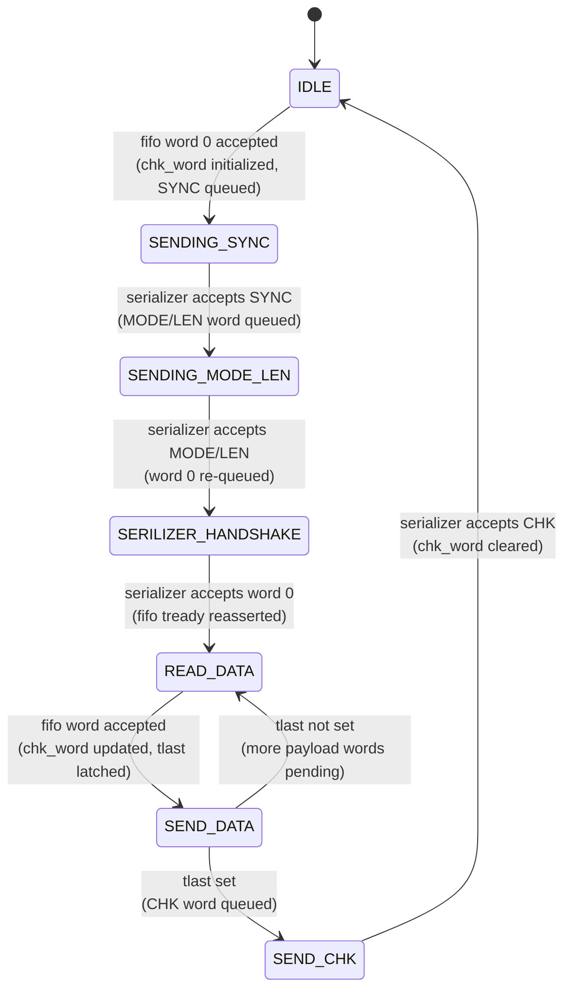

# UART_CONTROLLER — Product Guide

**AXI-Stream Frame Sequencer for UART Transmission**
Target device: Xilinx Basys 3 | VHDL-2008 | Vivado 2026.1
Author: Abdelrahman Hewala (Shiro)

---

## 1. Overview

`UART_CONTROLLER` sequences data from an upstream AXI-Stream FIFO into a fixed frame
structure (SYNC, MODE/LEN, PAYLOAD, CHK) and forwards it word-by-word to a downstream
16-bit AXI-Stream serializer, which in turn feeds the UART IP. The controller is
purely a framing/sequencing layer — data width, timing, and byte-level UART framing are
handled downstream by the serializer and UART core.

A single generic (`MODE`) selects which of two payload sources is framed: raw sensor
data (bypassing the EKF) or sensor data plus filter output.

---

## 2. Interface

### 2.1 Generics

| Generic | Type    | Default | Description |
|---------|---------|---------|--------------|
| `MODE`  | natural | 0       | `0` = bypass EKF, forward raw ICM data. Any other value = include EKF output in the payload. |

### 2.2 Ports

| Port | Dir | Width | Description |
|------|-----|-------|--------------|
| `clk` | in | 1 | System clock. |
| `rst_n` | in | 1 | Active-low synchronous reset. |
| `s_axis_fifo_tdata` | in | 16 | Payload word from upstream FIFO. |
| `s_axis_fifo_tvalid` | in | 1 | Upstream has data. |
| `s_axis_fifo_tlast` | in | 1 | Marks the final payload word of the frame. |
| `s_axis_fifo_tready` | out | 1 | Controller can accept a new payload word. |
| `m_axis_tdata` | out | 16 | Frame word to serializer. |
| `m_axis_tvalid` | out | 1 | Frame word valid. |
| `m_axis_tready` | in | 1 | Serializer can accept the word. |

---

## 3. Frame Layout & Checksum

| Word(s) | Content |
|---------|---------|
| 1 | SYNC — `0xAA55` |
| 2 | MODE/LEN — upper byte = `MODE`, lower byte = payload length in bytes (`0x1E` for MODE 0, `0x2A` for MODE 1) |
| 3 .. N | Payload — N words, length determined by upstream `s_axis_fifo_tlast` placement, not by the LEN field |
| N+1 | CHK — running XOR of all N payload words |

CHK accumulates across the payload as each word is accepted from the FIFO and is
cleared to `0x0000` on completion of `SEND_CHK`, before the next frame's first word is
latched — each frame's checksum is independent of the previous frame.

The LEN byte in the MODE/LEN word is a fixed literal per `MODE`, not derived from the
actual payload length observed via `tlast`. If the payload word count for a given mode
changes, `MODE_0`/`MODE_1` must be updated by hand to match.

---

## 4. FSM

- **IDLE** — Accepts the first payload word from the FIFO, latches it (sent later in
  `SENDING_MODE_LEN`), initializes `chk_word`, and queues SYNC.
- **SENDING_SYNC** — Holds SYNC until the serializer accepts it, then queues the
  MODE/LEN word (`MODE_0` or `MODE_1` per the `MODE` generic).
- **SENDING_MODE_LEN** — Holds MODE/LEN until accepted, then re-queues the payload
  word latched in `IDLE`.
- **SERILIZER_HANDSHAKE** — Holds that first payload word until accepted, then
  reasserts `s_axis_fifo_tready` to resume reading the FIFO.
- **READ_DATA** — Accepts the next payload word from the FIFO, updates `chk_word`,
  latches its `tlast`, and forwards it to the serializer.
- **SEND_DATA** — Holds the word until the serializer accepts it. Returns to
  `READ_DATA` for the next word, or moves to `SEND_CHK` if `tlast` was set.
- **SEND_CHK** — Holds the CHK word until accepted, clears `chk_word`, and returns to
  `IDLE`.

---

## 5. Known Limitations

- **LEN field is static per mode**, not computed from the observed payload length —
  see Section 3.
- **No frame length validation**: the controller trusts `s_axis_fifo_tlast` placement
  from upstream; it does not independently verify the payload word count against the
  encoded LEN.

---

## 7. Revision

| Rev | Date | Notes |
|-----|------|-------|
| 0.01 | — | Initial FSM implementation. |
| 0.02 | 2026-08-18 | Fixed `chk_word` not being cleared between frames — added reset in `SEND_CHK` before returning to `IDLE`. Added self-checking two-frame testbench (Section 6). |