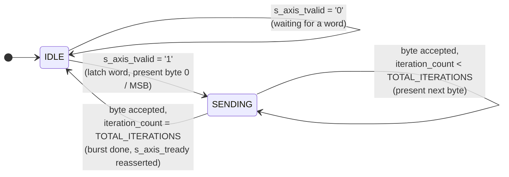

# axis_serializer — Product Guide

**AXI-Stream Width Downsizer / Serializer**
Target device: Xilinx Basys 3 | VHDL-2008 | Vivado 2026.1  
Author: Abdelrahman Hewala (Shiro)

---

## 1. Overview

`axis_serializer` accepts one wide AXI-Stream word and transmits it as a sequence of
8-bit AXI-Stream beats, most significant byte first. It exists because the SPI
controller's payload is 16 bits wide, while UART transfers one byte at a time; this
module performs the conversion between the two.

The module is a generic AXI-Stream width converter and is not UART-specific.
`DATA_WIDTH` is a generic, automatically rounded up to the next multiple of 8. The
RTL makes no assumption of a 16-bit input or a UART on the output side; in this
pipeline it is used for that purpose.

---

## 2. Interface

### 2.1 Generics

| Generic     | Type    | Default | Description |
|-------------|---------|---------|-------------|
| `DATA_WIDTH`| natural | 16      | Input word width. Rounded up to the next multiple of 8 if not already one. |

### 2.2 Ports

| Port            | Dir | Width | Description |
|-----------------|-----|-------|-------------|
| `clk`           | in  | 1     | System clock. |
| `rst_n`         | in  | 1     | Active-low synchronous reset. |
| `s_axis_tdata`  | in  | rounded `DATA_WIDTH` | Input word (AXI-Stream `tdata`). |
| `s_axis_tvalid` | in  | 1     | Upstream has a word (AXI-Stream `tvalid`). |
| `s_axis_tready` | out | 1     | Module can accept a new word (AXI-Stream `tready`). Held low for the duration of each burst. |
| `m_axis_tdata`  | out | 8     | Current byte of the burst (AXI-Stream `tdata`). Byte 0 is the input word's most significant byte. |
| `m_axis_tvalid` | out | 1     | Current byte ready (AXI-Stream `tvalid`). |
| `m_axis_tready` | in  | 1     | Downstream can accept the byte (AXI-Stream `tready`). |

**Byte order:** Most significant byte first. Any downstream consumer reassembling
these bytes (a PC-side script, another FPGA block) must follow this convention;
byte order is fixed by the module design and is not negotiated in-band.

---

## 3. Structure

This module is an AXI-Stream width downsizer. One wide input transaction produces
`TOTAL_ITERATIONS` narrow output transactions, where

```
TOTAL_ITERATIONS = ceil(DATA_WIDTH / 8)
```

At the default `DATA_WIDTH = 16`, this is 2 bytes per input word.

### 3.1 State Machine



**IDLE.** Waits for `s_axis_tvalid`. On handshake, the input word is latched into an
internal register, the first (most significant) byte is presented on `m_axis_tdata`,
and `s_axis_tready` is deasserted. No new word is accepted until the current one has
been fully transmitted.

**SENDING.** Every byte, including the final one, advances only on a valid
`m_axis_tready = '1' and m_axis_tvalid_r = '1'` handshake. An earlier revision
completed the final byte based on the iteration counter alone, without a handshake
check, which allowed `tvalid` to deassert before the receiver had accepted the byte.
Since UART's `din_ready` remains low for the full transmission time of a byte, this
could drop the least significant byte of a sample. All transitions in the current
revision, including the return to `IDLE`, are gated on the handshake, so no byte
completes before it is accepted.

### 3.2 Latched vs. live input

The input word is latched in `IDLE` and used for every subsequent byte slice in
`SENDING`, rather than reading the live `s_axis_tdata` port throughout the burst.
AXI-Stream requires the upstream master to hold data stable while `tready` is low,
so either approach is functionally correct today. Latching removes the dependency
on that upstream behavior, so the module remains correct if the upstream source
changes.

---

## 4. Design Notes

**Registered outputs.** Every port (`s_axis_tready`, `m_axis_tdata`,
`m_axis_tvalid`) is driven from a single internal register, with one concurrent
assignment binding each register to its port.

**Signal-bounded slicing.** The byte-select expressions in `SENDING` slice the
latched input register using `iteration_count`, a signal rather than a
locally-static constant. This requires VHDL-2008's relaxed slice-bound rules,
consistent with the rest of this project. Confirm the language mode is set
accordingly.

**Single-buffered.** `s_axis_tready` remains low for the entire burst, so the
upstream source cannot supply a new word until the current one is fully
transmitted. This sets the pipeline's actual throughput ceiling at
`1 / (byte_time × TOTAL_ITERATIONS)`, determined by the downstream UART baud rate.
A double-buffered implementation, latching the next word while the final byte of
the current word is still transmitting, would remove one cycle of dead time per
transaction. This is not required in the current design, since UART baud rate is
the throughput bottleneck, not this FSM.

---

## 5. Verification

**Hardware timing (ILA).** With this module driven live by the SPI controller at a
48.007 kHz sample rate, an ILA probe on `s_axis_tvalid`/`s_axis_tready` measured
exactly 2083 clock cycles between successive input handshakes, matching the
pipeline's theoretical sample period exactly. No drift or jitter was observed
across multiple captures. This confirms the module maintains pace with its
upstream source under real operating conditions.

**End-to-end audio validation.** Exercised as the middle stage of the full
mic-acquisition pipeline (ADC → SPI → FIFO → serializer → UART). Recorded speech,
streamed live through this module, was reconstructed correctly into a WAV file on
the PC side and was clearly recognizable. This confirms correct byte ordering and
handshake timing under sustained data flow, not only under a single isolated
transfer.

---

## 6. Known Limitations

**8-bit output only.** `m_axis_tdata` is fixed at 8 bits regardless of
`DATA_WIDTH`. This module always serializes down to bytes, not to arbitrary
narrower widths.

**No mid-burst reconfiguration.** `DATA_WIDTH` is a generic, fixed at synthesis
time. The module cannot change burst length at runtime.

---

## 7. Revision

| Rev  | Date       | Notes |
|------|------------|-------|
| 0.01 | 2026-08-07 | Initial serializer FSM. |
| 0.02 | 2026-08-11 | No RTL changes. Added hardware verification results (Section 5). |
