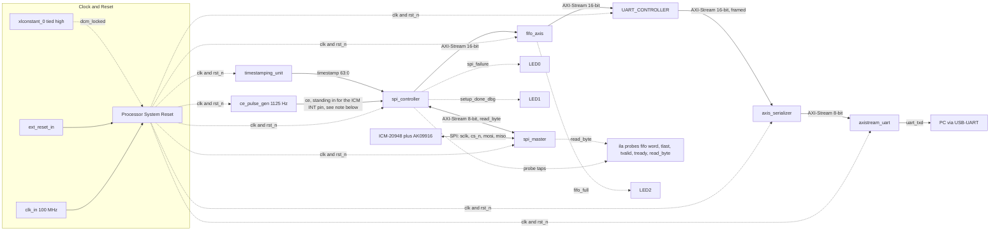

# FPGA — IMU Acquisition Pipeline

FPGA-based real-time IMU acquisition pipeline for the EKF with HLS project.
Reads an ICM-20948 (6-axis IMU plus AK09916 magnetometer) over SPI at
1.125 kHz, timestamps and frames each sample, and streams it to a PC over
UART for decoding, unit conversion, and (eventually) the Kalman filter for design stage. (on going dev for the EKF with HLS)

Target device: Xilinx Basys 3 (xc7a35tcpg236-1) | VHDL-2008 | Vivado 2026.1

---

## Repository Structure

```
FPGA/
├── IP_repo/            Custom Vivado IP cores, already packaged and ready to import
│   ├── AXI_STREAM_UART/
│   ├── axis_serializer/
│   ├── CLOCK_EN/
│   ├── FIFO_AXIS/
│   ├── SPI_CONTROLLER/
│   ├── SPI_MASTER/
│   ├── timestamping_unit/
│   └── UART_CONTROLLER/
├── Constrain_files/     XDC constraint files (Basys-3-Master.xdc, streaming.xdc)
├── block_designs/       Exported block design Tcl (IMU_Streaming.tcl)
└── Tcl/                 Project (re)creation script (create_project.tcl)
```
 
Each IP under `IP_repo/` follows the same layout:
 
```
IP_repo/<IP_NAME>/
├── doc/                    ProductGuide PDF, some simple ips don't have a one, complex ones do
├── src/                    VHDL source
├── tb/                     Testbench, where one exists (see Simulation below)
├── sim/                    GHDL/GTKWave Makefile and generated waveform, where one exists
├── xgui/                   Vivado IP packager GUI customization files
├── component.xml           Vivado IP-XACT descriptor
└── readme.md               Product Guide as .md file (Interface, internals, known limitations, verification (.md, occasionally also .pdf)) - some simple ips don't have a one, complex ones do
```
 
Every IP here is already packaged output (`component.xml` plus `xgui`),
so it is picked up as soon as `IP_repo` is added to `ip_repo_paths` and
`update_ip_catalog` is run, both handled automatically by
`create_project.tcl` below.
 
The host-side pipeline that reads, decodes, and converts the UART stream
lives outside this folder, at:
 
```
Code/PCsetup/PCsetup4FPGA/
├── UARTFPGA_reader.py    Frame sync, checksum, struct.unpack, mode dispatch
├── frame_types.py         RawSampleMode0 (and future RawSampleMode1)
├── sample_converter.py    Raw counts to physical units (g, rad/s, uT, C)
└── app.py                 Wires the three together, prints live samples
```
 
`build/` (the recreated Vivado project itself) is generated one directory
above the repository root and is not tracked in version control. See below.

## Recreating the Project

**Prerequisites:** Vivado 2026.1, part `xc7a35tcpg236-1` (Basys 3).

1. Open Vivado's Tcl Console (Window to Tcl Console)
2. Source the recreation script:
   ```tcl
   source /path/to/repo/FPGA/Tcl/create_project.tcl
   ```
3. The script:
   - Creates a new project at `build/imu_streaming`, one level above the
     repository root.
   - Adds `FPGA/IP_repo` as a custom IP repository and updates the catalog.
   - Adds both `Basys-3-Master.xdc` and `streaming.xdc`, and sets
     `streaming.xdc` as the target constraints file.
   - Recreates the block design from `IMU_Streaming.tcl`.
   - Generates a wrapper and IP output products.
4. Open `build/imu_streaming/imu_streaming.xpr` and run Synthesis,
   Implementation, and Generate Bitstream as normal.

The script resolves all paths relative to its own file location, so it can
be sourced from any working directory.

---

## Architecture



`ce_pulse_gen` sets the 1.125 kHz sample rate. `timestamping_unit` provides
a free-running 64-bit timestamp, latched by `spi_controller` on every
sample. `spi_controller` runs a table-driven setup sequence on the
ICM-20948 and AK09916 once at reset, then on each sample drives
`spi_master` through a single burst SPI read and packs the result into a
15-word AXI-Stream burst for `fifo_axis`. `UART_CONTROLLER` sequences that
burst into a SYNC and MODE/LEN and PAYLOAD and CHK frame, `axis_serializer`
downsizes the 16-bit words into 8-bit AXI-Stream beats, and
`axistream_uart` streams the framed bytes to the PC over UART.

**Note on the interrupt pin:** the ICM-20948's real `IMU_INT` pin is
currently not wired into `spi_controller`. For testing, sampling is
triggered instead by `ce_pulse_gen`'s pulse directly, which is why the
block design shows `ce_pulse_gen_0.ce` feeding `spi_controller_0.IMU_INT`
rather than a board pin. This keeps the sample rate deterministic and kept like that for testing purposes. Switching to the real interrupt pin is a
planned follow-up, not done yet.

Full protocol details (frame layout, checksum, per-mode payload) and each
IP's generics and known limitations are documented per-IP under
`IP_repo/<IP_NAME>/`.

---

## PC-side Pipeline

`Code/PCsetup/PCsetup4FPGA/` decodes and converts the UART stream on the
host side, in three layers plus an entry point:

1. **`UARTFPGA_reader.py`** resyncs on the SYNC bytes, validates the
   checksum, and dispatches on the MODE and LEN word to construct a typed
   raw sample (`RawSampleMode0` no EKF, `RawSampleMode1` with EKF ( reserved for once the EKF output payload is finalized on the FPGA side)).
2. **`frame_types.py`** holds those raw sample type definitions, shared
   between the reader and the converter so neither has to depend on the
   other.
3. **`sample_converter.py`** converts raw register counts into physical
   units the EKF will actually consume: m/s squared for acceleration,
   rad/s for angular rate, degrees C for temperature, uT for the
   magnetic field. Calibration constants (sensitivity, timestamp tick
   rate) are supplied at construction, not hardcoded, since guessing them
   wrong would silently produce plausible-looking but wrong values.
4. **`app.py`** wires the three together against the real serial port and
   prints each converted sample as it arrives.

```
FPGA (ICM-20948 to UART frame)  --UART-->  UARTFPGA_reader.py (decode)
    --> frame_types.py (typed raw sample)
    --> sample_converter.py (physical units)
    --> app.py (live output, eventually the EKF and dashboard)
```

Run it with:

```
pip install pyserial
python Code/PCsetup/PCsetup4FPGA/app.py
```

Set `PORT` in `UARTFPGA_reader.py` to match your machine first (see the
comment next to the constant for how to find it on macOS, Linux, or
Windows).

---

## Known Limitations

- **MODE_1 (IMU data plus EKF output) is not implemented end to end yet.**
  Only MODE_0 (raw IMU bypass) has a finalized frame format, decoder, and
  converter path.
- **Downstream backpressure is assumed to stay under one SPI byte period.**
  If `m_axis_fifo_tready` in `spi_controller` is ever held low longer than
  that, SPI byte tracking desyncs. Not exercised in current testing.
- **Magnetometer ST2 status byte behavior does not fully match the
  AK09916 datasheet** in observed captures. The upper bits of what should
  be a mostly-reserved status byte step through a repeating pattern
  rather than staying fixed. This does not affect accel, gyro, temp, or
  the magnetic field readings themselves, and the current plan is to
  detect fresh magnetometer samples by comparing consecutive readings
  rather than relying on the status byte.
- **The ICM-20948's real interrupt pin is not yet connected**, as noted
  in the architecture section above