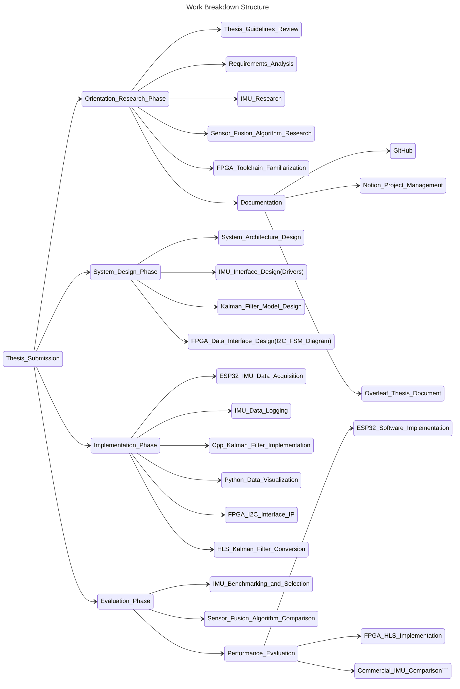

# IMU Kalman Filter on FPGA using High-Level Synthesis

## Overview

This repository contains the work and documentation for my Bachelor Thesis, which focuses on the implementation of IMU sensor fusion using a Kalman filter on an FPGA platform using High-Level Synthesis (HLS).

The goal of the project is to investigate how sensor fusion algorithms for Inertial Measurement Units (IMUs) can be efficiently implemented on FPGA hardware using modern open-source toolchains and high-level design methods.

The project explores the full pipeline starting from sensor data acquisition, through algorithm development and validation in software, to hardware acceleration on FPGA.

## WBS

