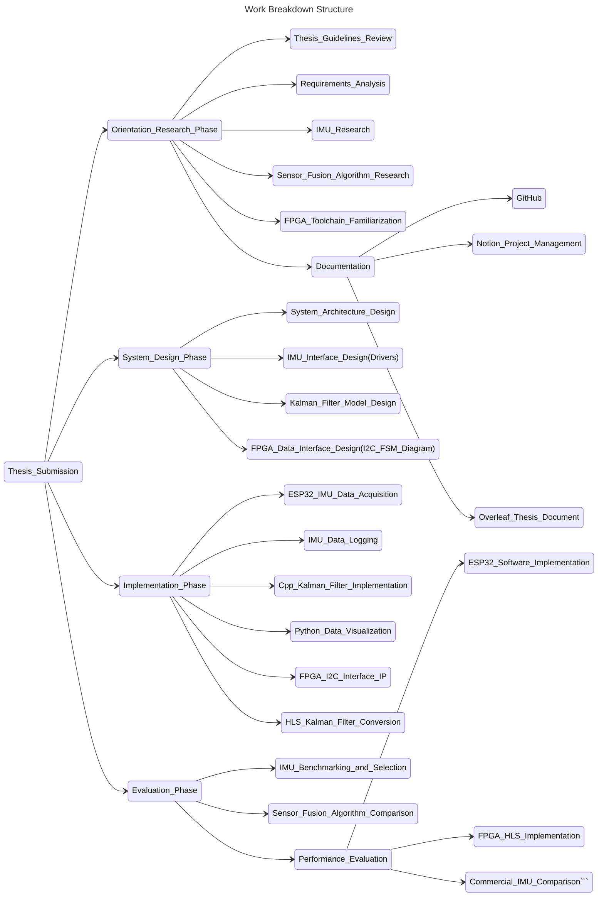

# IMU Kalman Filter on FPGA using High-Level Synthesis

Bachelor thesis project on implementing IMU sensor fusion with a Kalman
filter on an FPGA, using High-Level Synthesis (HLS). The project runs the
full pipeline start to finish: benchmarking candidate IMUs using Allan Variance, Noise characterization, acquiring
sensor data on real hardware, designing and validating the filter in
software, and finally accelerating it on FPGA fabric.

Supervisor: Prof. Lutz Leutelt

---

## Repository Structure

```
IMU-Kalman-filter-on-an-FPGA-with-High-level-Synthesis/
├── Code/
│   ├── ESP32/                FreeRTOS ESP32 firmware for IMU benchmarking
│   └── PCsetup/
│       ├── PCsetup4ESP32/    Allan variance streamlit benchmarking dashboard
│       └── PCsetup4FPGA/     UART decode, unit conversion, live pipeline
├── DataSheets/               Datasheets for every sensor or board in use
├── FPGA/                     Vivado project recreation, IP repo, block design, TCLs and more. Pls See FPGA/README.md
├── Literature/                Reference material, Kalman filter design notebook
└── README.md                  This file
```

`FPGA/README.md` covers the FPGA acquisition pipeline in full detail:
architecture, IP cores, build instructions, and the PC-side decode
pipeline. 

---


## WBS


```mermaid
---
title: Work Breakdown Structure
---
stateDiagram-v2
direction LR

    Thesis_Submission --> Orientation_Research_Phase
    Thesis_Submission --> System_Design_Phase
    Thesis_Submission --> Implementation_Phase
    Thesis_Submission --> Evaluation_Phase


%% ---------------- Orientation / Research ----------------
    Orientation_Research_Phase --> Thesis_Guidelines_Review
    Orientation_Research_Phase --> Requirements_Analysis
    Orientation_Research_Phase --> IMU_Research
    Orientation_Research_Phase --> Sensor_Fusion_Algorithm_Research
    Orientation_Research_Phase --> FPGA_Toolchain_Familiarization
    Orientation_Research_Phase --> Documentation

    Documentation --> GitHub
    Documentation --> Notion_Project_Management
    Documentation --> Overleaf_Thesis_Document


%% ---------------- System Design ----------------
    System_Design_Phase --> System_Architecture_Design
    System_Design_Phase --> IMU_Interface_Design(Drivers)
    System_Design_Phase --> Kalman_Filter_Model_Design
    System_Design_Phase --> FPGA_Data_Interface_Design(I2C_FSM_Diagram)

%% ---------------- Implementation ----------------
    Implementation_Phase --> ESP32_IMU_Data_Acquisition
    Implementation_Phase --> IMU_Data_Logging
    Implementation_Phase --> Cpp_Kalman_Filter_Implementation
    Implementation_Phase --> Python_Data_Visualization
    Implementation_Phase --> FPGA_I2C_Interface_IP
    Implementation_Phase --> HLS_Kalman_Filter_Conversion


%% ---------------- Evaluation ----------------
    Evaluation_Phase --> IMU_Benchmarking_and_Selection
    Evaluation_Phase --> Sensor_Fusion_Algorithm_Comparison
    Evaluation_Phase --> Performance_Evaluation

    Performance_Evaluation --> ESP32_Software_Implementation
    Performance_Evaluation --> FPGA_HLS_Implementation
    Performance_Evaluation --> Commercial_IMU_Comparison```
```

## Where things stand

- **IMU benchmarking** : done. Three candidate IMUs logged simultaneously
  on an ESP32, compared by Allan variance.
- **FPGA acquisition pipeline** : done, end to end. ICM-20948 over SPI,
  timestamped, framed, streamed over UART, decoded and converted to
  physical units on the PC. See `FPGA/README.md`.
- **Kalman filter design** : done. The filter design itself (state
  vector, process and measurement models) is finished, worked out in
  `Literature/KalmanFilter/Kalman_Filter_for_IMU_Explained_v1.ipynb`.
  What is left is fine-tuning against real logged sensor data in Python.
- **HLS conversion** : not started yet. Follows once the Python filter is
  tuned and validated against real data from the FPGA pipeline.

---

## Phase 1: IMU Benchmarking

Before committing to a sensor for the FPGA build, three IMUs were
benchmarked against each other by Allan variance: the MPU6050, the
ICM-20948, and the WitMotion WT901.

An ESP32 (`Code/ESP32/ESP32_data_Aquisition/`) reads all three sensors in

parallel on a 1kHz hardware timer, using a FreeRTOS producer, consumer 
pair of tasks (a collector task filling triple-buffered frames, a logger
task writing them to SD card) so sampling stays on schedule even while the
SD card is being written to. Each 50-byte frame holds a 64-bit
microsecond timestamp plus raw accel, gyro, and temperature counts from
all three IMUs.

`Code/PCsetup/PCsetup4ESP32/AllenVarianceBenchmarkingDashboard/` is a
Streamlit dashboard that loads a recorded `DATA.BIN` file, scales each
sensor into physical units, and computes Allan deviation per axis per
sensor, extracting ARW, bias instability, and rate random walk for direct
comparison. Run it with:

```
streamlit run dashboardV2.py
```

`decoder.py` in the same folder is a small standalone script for
inspecting a `.BIN` file's frame headers directly, useful for quick
sanity checks without opening the full dashboard.

The full methodology (outlier handling, the WT901's native versus logged
sample rate, bandwidth normalization) is documented inline in
`data_engine_V2.py`

---

## Phase 2: FPGA Acquisition Pipeline

Covered in full in `FPGA/README.md`. In short: an ICM-20948 is read over
SPI at 1.125kHz, timestamped, framed into a checksummed protocol, and
streamed to a PC over UART. `Code/PCsetup/PCsetup4FPGA/` decodes that
stream, dispatches on frame mode, and converts raw register counts into
physical units, ready for the Kalman filter.

---

## Phase 3: Kalman Filter and HLS

The filter design is complete, and its derivation lives in
`Literature/KalmanFilter/Kalman_Filter_for_IMU_Explained_v1.ipynb`.
Current work is fine-tuning it in Python against real data captured
through the FPGA pipeline above, rather than synthetic input. Once tuned
and validated, the next stage is porting the filter to HLS for FPGA
acceleration.
